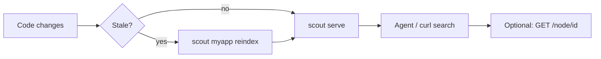

# Scout

**Local code-graph + vector search for coding agents.**

Scout indexes a workspace, builds a structural code graph, embeds symbol-level chunks, and exposes semantic search over REST. Agents query snippets and graph neighbors instead of loading entire files — saving tokens and surfacing relevant context faster.

```
scan → tree-sitter parse → petgraph (in-memory) → sqlite-vec embeddings → REST search
```

| Layer | Technology | Role |
|-------|------------|------|
| Engine | Rust (`scout_core`) | Scan, parse, graph, chunk, vector index, search |
| Shell | Python (`scout/`) | CLI, FastAPI, embed providers, setup wizard, skills |
| Storage | `.scout/` | Config, secrets, per-space `index.db` + `graph.bin` cache |
| Agents | Cursor / Pi / OpenCode skills | HTTP search + optional index-first code review |

---

## Quick start

Already on macOS or Linux with Python 3.11+, Rust, and a running embed server (LM Studio, etc.)?

```bash
git clone https://github.com/tjax4376/scout.git && cd scout
scripts/scout.sh build dev && source .venv/bin/activate
scout myapp setup --agent cursor          # wizard: workspace + index + skill
scout serve                               # separate terminal — REST API
curl -s http://127.0.0.1:8741/v1/health   # {"status":"ok"}
scout myapp search "main entry point"     # works without serve too
```

First time? See [Prerequisites](#prerequisites), then pick your OS below.

---

## Table of contents

- [Quick start](#quick-start)
- [Prerequisites](#prerequisites)
- [Install — macOS](#install--macos)
- [Install — Linux](#install--linux)
- [Install — Windows](#install--windows)
- [After install (all platforms)](#after-install-all-platforms)
- [First-time setup (index a project)](#first-time-setup-index-a-project)
- [Day-to-day workflow](#day-to-day-workflow)
- [CLI reference](#cli-reference)
- [REST API](#rest-api)
- [Agent skills](#agent-skills)
- [Configuration](#configuration)
- [Embed providers](#embed-providers)
- [Architecture](#architecture)
- [Development](#development)
- [Distribution](#distribution)
- [Project layout](#project-layout)
- [Further reading](#further-reading)

---

## Prerequisites

| Requirement | Notes |
|-------------|-------|
| **Python 3.11+** | 3.14 supported with abi3 build flag (see below) |
| **Rust toolchain** | For building `scout_core` from source (`rustup`, `cargo`) |
| **Embed endpoint** | Local LLM server (LM Studio, etc.) or OpenRouter API key |
| **Git** | Only if using setup branch 3 or 4 (clone repo into cwd) |

**Python 3.14:** set `PYO3_USE_ABI3_FORWARD_COMPATIBILITY=1` when building the Rust extension.

---

## Install — macOS

Tested on Apple Silicon and Intel. Homebrew paths shown; adjust if you use system Python.

### 1. System dependencies

```bash
# Xcode CLI tools (compilers + git)
xcode-select --install

# Homebrew (if missing): https://brew.sh
brew install python@3.12 rust git
```

### 2. Clone and build

```bash
git clone https://github.com/tjax4376/scout.git
cd scout

scripts/scout.sh build dev
source .venv/bin/activate

# Sanity check
python -c "import scout_core; print(scout_core.py_core_version())"
scout
```

**Manual build** (same result as the script):

```bash
python3 -m venv .venv && source .venv/bin/activate
pip install maturin pytest pytest-asyncio httpx pyyaml rich typer fastapi uvicorn pydantic
PYO3_USE_ABI3_FORWARD_COMPATIBILITY=1 maturin develop --release
```

### 3. Local embed server (recommended)

Install [LM Studio](https://lmstudio.ai), load an **embedding** model, start the local server (default port `1234`):

```bash
curl -s http://127.0.0.1:1234/v1/models
```

Then continue to [After install](#after-install-all-platforms).

---

## Install — Linux

Clone, compile the Rust extension, and run from a venv. Examples use Debian/Ubuntu `apt`; on Fedora/RHEL swap for `dnf` equivalents.

### 1. System dependencies

```bash
sudo apt update
sudo apt install -y git curl build-essential pkg-config python3 python3-venv python3-pip

# Rust (official installer)
curl --proto '=https' --tlsv1.2 -sSf https://sh.rustup.rs | sh
source "$HOME/.cargo/env"
rustc --version
```

### 2. Clone and compile

```bash
git clone https://github.com/tjax4376/scout.git
cd scout

scripts/scout.sh build dev
source .venv/bin/activate

python -c "import scout_core; print(scout_core.py_core_version())"
pytest -q    # optional
scout
```

**Manual compile** (if you prefer not to use the helper script):

```bash
python3 -m venv .venv
source .venv/bin/activate
pip install maturin pytest pytest-asyncio httpx pyyaml rich typer fastapi uvicorn pydantic
PYO3_USE_ABI3_FORWARD_COMPATIBILITY=1 maturin develop --release
```

### 3. Production wheel (optional)

```bash
scripts/scout.sh build production
source .venv-prod/bin/activate
scout
```

Then continue to [After install](#after-install-all-platforms).

---

## Install — Windows

Scout MVP1 is developed and tested on **macOS and Linux only**.

If you want Windows support, **fork the repository and implement it yourself** — you will need to adapt the Rust/maturin build, path handling, and local embed provider setup for your environment. Upstream does not maintain Windows install steps.

---

## After install (all platforms)

These steps are the same once `scout` runs and prints usage.

### 1. Start your embed server

Scout needs an embedding model at index and search time. Start your server **before** setup/reindex.

| Provider | Default port | Example check |
|----------|--------------|---------------|
| LM Studio | `1234` | `curl http://127.0.0.1:1234/v1/models` |
| OMLX | `8080` | `curl http://127.0.0.1:8080/v1/models` |
| Unsloth Studio | `8000` | `curl http://127.0.0.1:8000/v1/models` |
| OpenRouter | — | API key at [openrouter.ai](https://openrouter.ai) |

Use an **embedding** model, not a chat model.

### 2. Run setup (creates space + index)

```bash
scout myapp setup --agent cursor
```

Registers space `myapp`, indexes the workspace, installs the `search_scout` skill. See [First-time setup](#first-time-setup-index-a-project) for wizard details.

### 3. Start the API server

Separate terminal — `scout serve` runs in the foreground:

```bash
source .venv/bin/activate
scout serve
# Serving on http://127.0.0.1:8741/v1
```

Or: `scripts/scout.sh start`

### 4. Verify

```bash
curl -s http://127.0.0.1:8741/v1/health
curl -s http://127.0.0.1:8741/v1/spaces/list

curl -s -X POST http://127.0.0.1:8741/v1/spaces/myapp/search \
  -H "Content-Type: application/json" \
  -d '{"query": "authentication handler", "top_k": 5}'

scout myapp search "authentication handler" --top-k 5   # CLI — no serve required
```

---

## First-time setup (index a project)

`scout <space> setup` is the unified wizard. Every run walks through:

| Step | What happens |
|------|----------------|
| 1. API base URL | Full URL e.g. `http://127.0.0.1:8741/v1` (port scan `8741`–`8799` if busy) |
| 2. Setup branch | Pick files source + embed provider (see table below) |
| 3. Workspace | Local path or `git clone --depth 1` into cwd subdirectory |
| 4. Embed | Provider auth, model pick, dimension probe |
| 5. Prescan | File count, size, language breakdown, capacity gate |
| 6. Index | Full synchronous reindex (scan → graph → embed → atomic swap) |
| 7. Agent skill | Install `search_scout` with injected API URL + space name |

### Setup branches

| Branch | Files | Embed |
|--------|-------|-------|
| **1** | Local path | Local LLM (`lmstudio` / `omlx` / `unsloth-studio`) |
| **2** | Local path | OpenRouter |
| **3** | Git clone → cwd | Local LLM |
| **4** | Git clone → cwd | OpenRouter |

```bash
# Interactive (picks agent at prompt)
scout myapp setup

# Non-interactive agent for CI
scout myapp setup --agent cursor
scout myapp setup --agent pi
scout myapp setup --agent opencode
```

API key prompts offer **leave blank to keep** if a key already exists in `~/.scout/secrets.yaml`.

### Reindex an existing space

After code changes or embed config changes:

```bash
scout myapp reindex
scout myapp reindex --force          # bypass 100GB byte-cap warning
```

---

## Day-to-day workflow



1. **Edit code** in the indexed workspace.
2. **Reindex** when search feels stale (`stale: true` in response, or `X-Scout-Stale: true` header).
3. **Keep serve running** while agents use the REST API.
4. **Stop serve** when done: `scout stop-serve` (from another terminal).

---

## CLI reference

**Command shape:** `<space>` first, then subcommand. The agent name is a **flag**, not a positional argument.

```
scout <space> setup   [--agent cursor|pi|opencode] [--force]
                      [--embed-batch N] [--reprobe-embed-batch]

scout <space> reindex [--force] [--embed-batch N] [--reprobe-embed-batch]

scout <space> search  <query> [--top-k N]

scout serve
scout stop-serve
```

### Common examples

| Task | Command |
|------|---------|
| Full setup + Cursor skill | `scout myapp setup --agent cursor` |
| Reindex after changes | `scout myapp reindex` |
| Reindex, skip byte-cap prompt | `scout myapp reindex --force` |
| Search (no serve needed) | `scout myapp search "error handling"` |
| Limit search results | `scout myapp search "handler" --top-k 5` |
| Start REST API | `scout serve` |
| Stop REST API | `scout stop-serve` |
| Auto embed batch (default) | `scout myapp reindex` |
| Fixed embed batch size | `scout myapp reindex --embed-batch 512` |
| Re-probe optimal batch | `scout myapp reindex --reprobe-embed-batch` |

### Common mistake

```bash
scout cursor setup              # wrong — "cursor" parsed as space name
scout myapp setup --agent cursor   # correct
```

`scout` with no arguments prints usage.

### Embed batch sizing

By default (`--embed-batch 0`), Scout probes the embed provider's `/models` metadata (`eval_batch_size`, `context_length`) and host RAM to pick an optimal batch size. Result is cached in `config.yaml` as `embed.embed_batch_size`. Use `--reprobe-embed-batch` to refresh.

---

## REST API

Start with `scout serve`. Base URL is configured at setup (default `http://127.0.0.1:8741/v1`). One server instance serves **all** spaces in config.

| Method | Path | Description |
|--------|------|-------------|
| `GET` | `/v1/health` | Liveness check |
| `GET` | `/v1/spaces/list` | List configured spaces |
| `POST` | `/v1/spaces/{space}/search` | Vector search + graph neighbors |
| `GET` | `/v1/spaces/{space}/node/{node_id}` | Full indexed chunk for one node |
| `POST` | `/v1/spaces/{space}/reindex` | Synchronous full index rebuild |

Interactive docs: `GET /docs` (Swagger UI). OpenAPI: `GET /v1/openapi.json`.

### Search request

```bash
curl -s -X POST "http://127.0.0.1:8741/v1/spaces/myapp/search" \
  -H "Content-Type: application/json" \
  -d '{
    "query": "validate user token",
    "top_k": 5,
    "min_score": 0.0,
    "kinds": ["function", "method"],
    "path_prefix": "src/api/"
  }'
```

| Field | Type | Default | Description |
|-------|------|---------|-------------|
| `query` | string | required | Natural-language or code search text |
| `top_k` | int | `10` | Max hits (`1`–`100`) |
| `min_score` | float | `0.0` | Minimum similarity (`0.0`–`1.0`) |
| `kinds` | string[] | all | Filter: `function`, `method`, `class`, `file`, … |
| `path_prefix` | string | all | Limit to `rel_path` prefix |

### Search response (shape)

```json
{
  "hits": [
    {
      "node_id": "a1b2c3d4e5f67890",
      "kind": "function",
      "symbol": "handleAuth",
      "rel_path": "src/api/handlers.ts",
      "start_line": 42,
      "end_line": 78,
      "score": 0.87,
      "snippet": "export async function handleAuth…",
      "breadcrumb": "src > api > handlers.ts > handleAuth",
      "neighbors": [
        { "node_id": "…", "kind": "function", "symbol": "verifyToken", "edge": "imports", "depth": 2 }
      ]
    }
  ],
  "stale": false,
  "index_version": "8f3a2b1c9d0e"
}
```

Response headers: `X-Scout-Stale`, `X-Scout-Index-Version`.

### Node lookup

```bash
curl -s "http://127.0.0.1:8741/v1/spaces/myapp/node/NODE_ID_FROM_HIT"
```

### Reindex via API

```bash
curl -s -X POST "http://127.0.0.1:8741/v1/spaces/myapp/reindex"
```

Returns `409` if a reindex is already in progress.

**Full API reference:** [`api-contracts.md`](api-contracts.md)

---

## Agent skills

Scout ships skill templates that agents invoke via REST. Setup installs `search_scout` automatically; `code-reviewer-scout` is installed separately.

### search_scout (installed by setup)

Teaches agents to search the codebase via Scout REST with graph neighbor context.

| Agent | Project install path |
|-------|---------------------|
| Cursor | `<project>/.cursor/skills/search_scout/` |
| Pi | `<project>/.pi/skills/search-scout/` |
| OpenCode | `<project>/.opencode/skills/search_scout/` |

Helper script (after install):

```bash
python skills/search_scout/scripts/scout_api.py search myapp "auth middleware" 5
python skills/search_scout/scripts/scout_api.py health
```

### code-reviewer-scout (standalone install)

Token-efficient code review: search snippets and neighbors **before** reading full files.

```bash
python -m scout.code_reviewer \
  --agent cursor \
  --project \
  --project-root . \
  --scout-api http://127.0.0.1:8741/v1 \
  --default-space myapp
```

| Agent | Project install path |
|-------|---------------------|
| Cursor | `<project>/.cursor/skills/code-reviewer-scout/` |
| Pi | `<project>/.pi/skills/code-reviewer-scout/` |
| OpenCode | `<project>/.opencode/skills/code-reviewer-scout/` |

Review helper:

```bash
python skills/code-reviewer-scout/scripts/review_api.py search myapp \
  "validate token" --path-prefix src/api/ --top-k 5
```

---

## Configuration

Scout stores state under `.scout/` (project-local if present, else `~/.scout/`).

```
.scout/
├── config.yaml          # spaces, embed provider, API URL, cached batch size
├── secrets.yaml         # API keys only (chmod 600)
├── scout.pid            # running serve PID
├── cache/
│   └── <space>/
│       └── graph.bin    # petgraph snapshot
└── spaces/
    └── <space>/
        ├── index.db     # sqlite-vec chunks + embeddings
        ├── manifest.json
        └── prescan.json
```

### Example `config.yaml`

```yaml
api_base_url: http://127.0.0.1:8741/v1
api_port: 8741
spaces:
  myapp:
    root: /path/to/project
    skip:
      globs: []
      paths: ["vendor/"]
embed:
  provider: lmstudio
  model: text-embedding-nomic-embed-text-v1.5
  endpoint: http://127.0.0.1:1234/v1
  dimensions: 768
  embed_batch_size: 4096   # 0 = auto-probe at next reindex
```

### Secrets (`secrets.yaml`)

```yaml
openrouter_api_key: sk-or-...
lmstudio_api_key: ...       # if your local server requires auth
```

Environment overrides: `LMSTUDIO_API_KEY`, `SCOUT_API_URL`, `SCOUT_API_TOKEN`.

---

## Embed providers

| Provider | Type | Default endpoint |
|----------|------|------------------|
| `lmstudio` | Local | `http://127.0.0.1:1234/v1` |
| `omlx` | Local | `http://127.0.0.1:8080/v1` |
| `unsloth-studio` | Local | `http://127.0.0.1:8000/v1` |
| `openrouter` | Remote | `https://openrouter.ai/api/v1` |

Scout uses **provider-scoped** API keys (`get_embed_api_key(secrets, provider)`). If both OpenRouter and LM Studio keys exist, the key matching the active embed provider is used.

---

## Architecture

```mermaid
flowchart TB
  subgraph agents [Coding agents]
    SK[search_scout skill]
    CR[code-reviewer-scout skill]
  end

  subgraph python [Python shell]
    CLI[scout CLI]
    API[FastAPI /v1]
    EMB[embed providers HTTP]
    SET[setup wizard]
  end

  subgraph rust [scout_core Rust]
    SCAN[scan + parse]
    GRAPH[petgraph]
    IDX[sqlite-vec index]
    SRCH[vector search + neighbors]
  end

  subgraph disk [.scout/]
    GB[graph.bin]
    DB[index.db]
    CFG[config.yaml]
  end

  SK --> API
  CR --> API
  CLI --> SCAN
  CLI --> SRCH
  API --> SRCH
  API --> EMB
  SET --> CLI
  SCAN --> GRAPH
  GRAPH --> GB
  EMB --> IDX
  IDX --> DB
  SRCH --> GB
  SRCH --> DB
```



**Pipeline:** folder scan → tree-sitter AST (Python, JS/TS, Rust, Go) → in-memory petgraph (`contains`, `imports`, `calls` edges) → symbol-level chunks → batched embeddings → atomic index swap.

**Search neighbors:** anchor pivot — up 1 via `contains`, BFS down depth ≤ 3, cap 20 neighbors.

**Staleness:** index marked stale when files change on disk or embed config changes. Stale indexes still return results; reindex to refresh.

---

## Development

```bash
# Build + test
scripts/scout.sh build dev
source .venv/bin/activate
pytest -q
cargo test -p scout_core

# Validate OpenSpec artifacts (also runs in CI)
scripts/scout.sh validate
# or: make validate-openspec
# or: python scripts/validate_openspec.py

# Start API from dev build
scripts/scout.sh start
```

### Build script commands

| Command | Action |
|---------|--------|
| `scripts/scout.sh build dev` | `.venv` + `maturin develop --release` |
| `scripts/scout.sh build production` | Release wheel → `.venv-prod` |
| `scripts/scout.sh start` | `scout serve` from dev venv |
| `scripts/scout.sh start production` | `scout serve` from prod venv |
| `scripts/scout.sh validate` | OpenSpec + API contract sync checks |

---

## Distribution

### PyPI / pipx

```bash
# After release is published
pipx install scout
```

> **Note:** PyPI package name `scout` may conflict with an older unrelated package (v4.x). For this project, prefer installing from a built wheel:
>
> ```bash
> PYO3_USE_ABI3_FORWARD_COMPATIBILITY=1 maturin build --release --out dist
> pipx install dist/scout-0.1.0-*.whl
> ```

Verify pipx install:

```bash
bash scripts/verify_pipx_install.sh
```

### Maintainer publish flow

1. Tag: `git tag v0.1.0 && git push origin v0.1.0`
2. GitHub Actions `.github/workflows/publish.yml` builds multi-platform abi3 wheels + sdist → PyPI
3. Requires PyPI trusted publisher or `PYPI_API_TOKEN` secret

---

## Project layout

```
scout_core/              # Rust engine (pyo3) — scan, parse, graph, search
scout/
  api/                   # FastAPI REST (/v1)
  cli/                   # CLI entry (setup, reindex, search, serve)
  code_reviewer/         # Standalone code-reviewer-scout skill installer
  config.py              # .scout/ config + secrets
  embed/                 # Embed provider registry + batch probe
  indexing.py            # Reindex orchestration
  prescan/               # Capacity gate + prescan metrics
  serve/                 # stop-serve lifecycle
  setup/                 # Unified 4-branch setup wizard
  skill/                 # search_scout skill installer
skills/
  search_scout/          # Agent search skill template
  code-reviewer-scout/   # Agent code-review skill template
tests/                   # pytest (api, cli, embed, integration, openspec)
openspec/                # Change specs and tasks
scripts/
  scout.sh               # build / start / validate helper
  validate_openspec.py   # Spec + API contract validator
api-contracts.md         # Full REST API reference
```

---

## Further reading

| Document | Contents |
|----------|----------|
| [`api-contracts.md`](api-contracts.md) | Complete REST API with examples (curl, Python, JS) |
| [`scope/scout-simple-mvp1.md`](scope/scout-simple-mvp1.md) | MVP1 requirements and architecture decisions |
| [`scout_core/README.md`](scout_core/README.md) | Rust engine modules and build |
| [`scout/api/README.md`](scout/api/README.md) | FastAPI app notes |
| [`.memory/cards.md`](.memory/cards.md) | Ops runbook — common issues and fixes |

---

## Troubleshooting

| Symptom | Likely cause | Fix |
|---------|--------------|-----|
| Search returns 500 / `ConnectError` | Embed server not running | Start LM Studio (or provider) on configured port; `curl …/v1/models` |
| Search returns 401 | Wrong API key sent to local provider | Update key in `secrets.yaml` via setup; ensure provider-scoped key |
| `scout serve already running` | Stale PID file | `scout stop-serve` then `scout serve` |
| `scout_core not built` | Rust extension missing | `scripts/scout.sh build dev` |
| `stale: true` in search | Files or embed config changed | `scout <space> reindex` |
| pipx `scout` wrong CLI | Name collision with PyPI scout 4.x | `pipx uninstall scout && pipx install dist/scout-0.1.0-*.whl` |
| Reindex panic on UTF-8 | Stale wheel before chunk fix | Rebuild wheel and reinstall |

---

**License:** MIT · **Version:** 0.1.0
