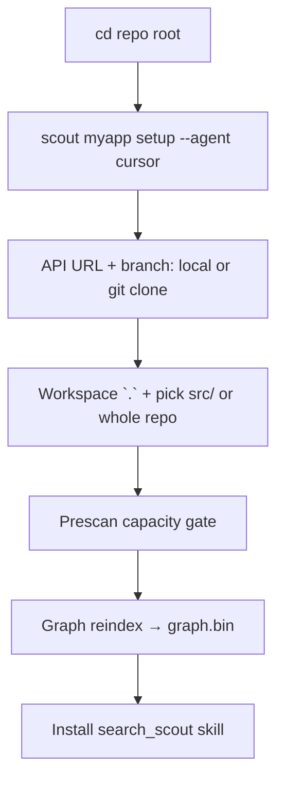
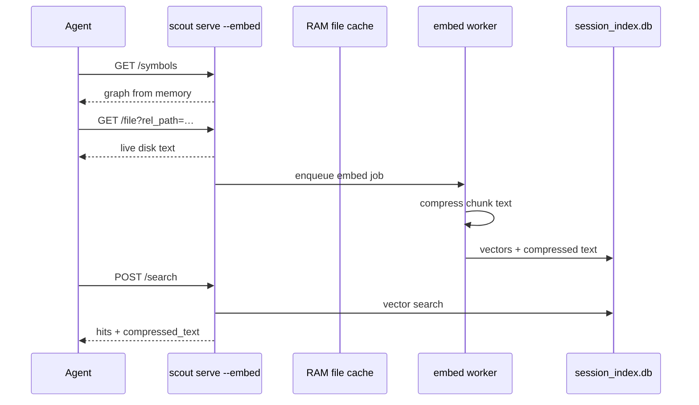
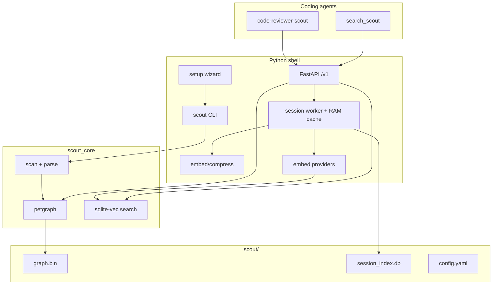

# Scout

**Local code graph + optional session vector search for coding agents.**

Scout indexes a workspace into a **structural code graph** (`graph.bin`) with `location_ref` file pointers. Agents map connections via REST and read **full source from disk** on demand. Default setup is **graph-only** (no full-repo embed). Opt in to **`scout serve --embed`** for session semantic search on files you read.

```
Default:  scan → tree-sitter → petgraph → graph.bin → REST (/symbols, /neighbors, /file)
Optional: scout serve --embed → RAM cache + session_index.db → POST /search (read files only)
```

| Layer | Technology | Role |
|-------|------------|------|
| Engine | Rust (`scout_core`) | Scan, parse, graph, vector index, search |
| Shell | Python (`scout/`) | CLI, FastAPI, embed providers, session worker, skills |
| Reviewer | Python (`scout/hawkeye/`) | **Hawkeye** — local graph-aware code review (rules, SARIF, trace) |
| Storage | `.scout/` | Config, `graph.bin`, optional `session_index.db` per space |
| Agents | Cursor / Pi / OpenCode skills | Graph map + search + code review |

---

## Quick start

Already on macOS or Linux with Python 3.11+ and Rust?

```bash
git clone https://github.com/tjax4376/scout.git && cd scout
scripts/scout.sh build dev              # clean, build, verify scout+hawkeye, start serve
# other terminal: source .venv/bin/activate
curl -s http://127.0.0.1:8747/v1/health   # port from "Serving on …" line
hawkeye setup --yes --space myapp         # after scout <space> setup indexed the repo
```

Graph-only setup needs **no embed server**. For `scout serve --embed`, start LM Studio (or OpenRouter) first — see [Embed providers](#embed-providers).

First time? See [Prerequisites](#prerequisites), then pick your OS below.

---

## Table of contents

- [Quick start](#quick-start)
- [Prerequisites](#prerequisites)
- [Install — macOS](#install--macos)
- [Install — Linux](#install--linux)
- [Install — Windows](#install--windows)
- [After install (all platforms)](#after-install-all-platforms)
- [First-time setup (index a project)](#first-time-setup-index-a-project)
- [Day-to-day workflow](#day-to-day-workflow)
- [Hawkeye code review](#hawkeye-code-review)
- [CLI reference](#cli-reference)
- [REST API](#rest-api)
- [Agent skills](#agent-skills)
- [Configuration](#configuration)
- [Embed providers](#embed-providers)
- [Architecture](#architecture)
- [Development](#development)
- [Distribution](#distribution)
- [Project layout](#project-layout)
- [Further reading](#further-reading)
- [Troubleshooting](#troubleshooting)

---

## Prerequisites

| Requirement | Notes |
|-------------|-------|
| **Python 3.11+** | 3.14 supported with abi3 build flag (see below) |
| **Rust toolchain** | For building `scout_core` from source (`rustup`, `cargo`) |
| **Embed endpoint** | Only for `scout serve --embed` or legacy vector search — **not** required for graph-only setup |
| **Git** | Only if using setup branch 2 (clone repo into cwd) |

**Python 3.14:** set `PYO3_USE_ABI3_FORWARD_COMPATIBILITY=1` when building the Rust extension.

---

## Install — macOS

Tested on Apple Silicon and Intel. Homebrew paths shown; adjust if you use system Python.

### 1. System dependencies

```bash
# Xcode CLI tools (compilers + git)
xcode-select --install

# Homebrew (if missing): https://brew.sh
brew install python@3.12 rust git
```

### 2. Clone and build

```bash
git clone https://github.com/tjax4376/scout.git
cd scout

scripts/scout.sh build dev
source .venv/bin/activate

# Sanity check
python -c "import scout_core; print(scout_core.py_core_version())"
scout
```

**Manual build** (same result as the script):

```bash
python3 -m venv .venv && source .venv/bin/activate
pip install maturin pytest pytest-asyncio httpx pyyaml rich typer fastapi uvicorn pydantic
PYO3_USE_ABI3_FORWARD_COMPATIBILITY=1 maturin develop --release
```

### 3. Local embed server (recommended)

Install [LM Studio](https://lmstudio.ai), load an **embedding** model, start the local server (default port `1234`):

```bash
curl -s http://127.0.0.1:1234/v1/models
```

Then continue to [After install](#after-install-all-platforms).

---

## Install — Linux

Clone, compile the Rust extension, and run from a venv. Examples use Debian/Ubuntu `apt`; on Fedora/RHEL swap for `dnf` equivalents.

### 1. System dependencies

```bash
sudo apt update
sudo apt install -y git curl build-essential pkg-config python3 python3-venv python3-pip

# Rust (official installer)
curl --proto '=https' --tlsv1.2 -sSf https://sh.rustup.rs | sh
source "$HOME/.cargo/env"
rustc --version
```

### 2. Clone and compile

```bash
git clone https://github.com/tjax4376/scout.git
cd scout

scripts/scout.sh build dev
source .venv/bin/activate

python -c "import scout_core; print(scout_core.py_core_version())"
pytest -q    # optional
scout
```

**Manual compile** (if you prefer not to use the helper script):

```bash
python3 -m venv .venv
source .venv/bin/activate
pip install maturin pytest pytest-asyncio httpx pyyaml rich typer fastapi uvicorn pydantic
PYO3_USE_ABI3_FORWARD_COMPATIBILITY=1 maturin develop --release
```

### 3. Production wheel (optional)

```bash
scripts/scout.sh build production
source .venv-prod/bin/activate
scout
```

Then continue to [After install](#after-install-all-platforms).

---

## Install — Windows

Scout MVP1 is developed and tested on **macOS and Linux only**.

If you want Windows support, **fork the repository and implement it yourself** — you will need to adapt the Rust/maturin build, path handling, and local embed provider setup for your environment. Upstream does not maintain Windows install steps.

---

## After install (all platforms)

These steps are the same once `scout` runs and prints usage.

### 1. Embed server (only for session search)

**Graph-only** setup and review (`/symbols`, `/neighbors`, `/file`) need **no** embed provider.

Start an embed server **before** `scout serve --embed` or CLI search against a vector index:

| Provider | Default port | Example check |
|----------|--------------|---------------|
| LM Studio | `1234` | `curl http://127.0.0.1:1234/v1/models` |
| OMLX | `8080` | `curl http://127.0.0.1:8080/v1/models` |
| Unsloth Studio | `8000` | `curl http://127.0.0.1:8000/v1/models` |
| OpenRouter | — | API key at [openrouter.ai](https://openrouter.ai) |

Use an **embedding** model, not a chat model.

### 2. Run setup (from repo root)

```bash
cd /path/to/your-repo
scout myapp setup --agent cursor
```

Wizard: API URL → local/git branch → workspace `.` → pick `src/` or whole repo → graph index → install `search_scout`.

### 3. Start the API server

Separate terminal — `scout serve` runs in the foreground:

```bash
source .venv/bin/activate
scout serve                              # graph-only (default)
scout serve --embed                      # session search + RAM file cache
scout serve --embed --no-warm-cache      # skip bulk RAM warm at startup
# Serving on http://127.0.0.1:8741/v1   ← port in config.yaml
```

Or: `scripts/scout.sh start`

If serve refuses to start with `already running` but nothing listens on that port, run `scout stop-serve` first (clears stale PID lock).

### 4. Verify

```bash
curl -s http://127.0.0.1:8741/v1/health
curl -s http://127.0.0.1:8741/v1/spaces/list

# Graph map (works on graph-only serve — no embed)
curl -s "http://127.0.0.1:8741/v1/spaces/myapp/symbols?path_prefix=src/"

# Session search (requires scout serve --embed + embed provider in config)
curl -s -X POST http://127.0.0.1:8741/v1/spaces/myapp/search \
  -H "Content-Type: application/json" \
  -d '{"query": "authentication handler", "top_k": 5}'

# Hawkeye CLIs (installed with scout package)
hawkeye --help
hawkeye setup --yes --space myapp    # discovers Scout on :8741-8799
```

---

## First-time setup (index a project)

`scout <space> setup` is the unified wizard. Every run walks through:

| Step | What happens |
|------|----------------|
| 1. API base URL | Full URL e.g. `http://127.0.0.1:8741/v1` (port scan `8741`–`8799` if busy) |
| 2. Setup branch | Local path **or** git clone into cwd subdirectory |
| 3. Workspace | Run from **repo root**; workspace path default `.` (= cwd); pick `src/` or whole repo |
| 4. Prescan | File count, size, language breakdown, capacity gate |
| 5. Index | Graph-only reindex (scan → graph → `graph.bin`; no embed, no `index.db`) |
| 6. Agent skill | Install `search_scout` at repo root with injected API URL + space name |

Setup installs **`search_scout` only**. Install **`code-reviewer-scout`** separately after serve is running (see [Agent skills](#agent-skills)).

If setup was interrupted or config is invalid, later CLI commands print friendly errors (not tracebacks) with a setup hint.

### Setup branches

Run `scout <space> setup` from your **repository top level** (normally your cwd).

| Branch | Files |
|--------|-------|
| **1** | Local — workspace path default `.` (current directory), then pick index folder (`src/`, etc.) or entire repo |
| **2** | Git clone → cwd subdirectory, then same index folder picker |

**Workspace path:** `.` or `./` means cwd. After the anchor is set, setup lists immediate child directories (excluding `node_modules`, `.git`, etc.) so you can index `src/` without typing paths.

No embed provider required. Each graph node includes `location_ref` (e.g. `src=/src/auth.py`) for agent file resolution via `GET /file`.

```bash
# Interactive (picks agent at prompt)
scout myapp setup

# Non-interactive agent for CI
scout myapp setup --agent cursor
scout myapp setup --agent pi
scout myapp setup --agent opencode
```

API key prompts offer **leave blank to keep** if a key already exists in `~/.scout/secrets.yaml`.

### Reindex an existing space

After code changes:

```bash
scout myapp reindex
scout myapp reindex --force          # bypass 100GB byte-cap warning
```

---

## Day-to-day workflow

### Setup flow (first time)



### Graph-first review (default — no embed)


1. **Edit code** in the indexed workspace.
2. **Reindex** when graph feels stale (`X-Scout-Stale: true`).
3. **Serve** — `scout serve` (graph-only) or `scout serve --embed` (adds session search).
4. **Map** — `GET /symbols` + `GET /neighbors` (no embed call).
5. **Read** — `GET /file` for authoritative source; `GET /node/{id}` for metadata + indexed text when embedded.
6. **Stop** — `scout stop-serve` from another terminal.

### Session embed search (`scout serve --embed`)



**Session search rules:** only files read via `GET /file` in this serve session are searchable. Read files first, then search. Hits include `compressed_text` (what was embedded). Full source always via `GET /file`.

**Tip:** After port or API URL change, reinstall skills (`--force`).

---

## Hawkeye code review

[Hawkeye](scout/hawkeye/README.md) is Scout's focused local code reviewer — rules + antipatterns YAML, graph trace, SARIF output. Requires `scout serve` running.

```bash
scout serve
hawkeye setup                              # discovers Scout on :8741-8799
hawkeye review --path src/auth/            # directory
hawkeye review --file scout/api/app.py     # single file
hawkeye review --diff origin/main          # git diff (default)
```

See [`scout/hawkeye/README.md`](scout/hawkeye/README.md) for setup discovery, exit codes, and hybrid escalation.

---

## CLI reference

**Command shape:** `<space>` first, then subcommand. The agent name is a **flag**, not a positional argument.

```
scout <space> setup   [--agent cursor|pi|opencode] [--force]
                      [--embed-batch N] [--reprobe-embed-batch]

scout <space> reindex [--force] [--embed-batch N] [--reprobe-embed-batch]

scout <space> search  <query> [--top-k N]

scout serve [--embed] [--no-warm-cache]
scout stop-serve
```

### Common examples

| Task | Command |
|------|---------|
| Full setup + Cursor skill | `scout myapp setup --agent cursor` |
| Reindex after changes | `scout myapp reindex` |
| Reindex, skip byte-cap prompt | `scout myapp reindex --force` |
| Search (no serve needed) | `scout myapp search "error handling"` |
| Limit search results | `scout myapp search "handler" --top-k 5` |
| Start REST API | `scout serve` |
| Open graph UI | `http://127.0.0.1:<port>/graph` (after `scout serve`) |
| Start with session embed | `scout serve --embed` |
| Session embed, lazy RAM cache | `scout serve --embed --no-warm-cache` |
| Stop REST API | `scout stop-serve` |
| Auto embed batch (default) | `scout myapp reindex` |
| Fixed embed batch size | `scout myapp reindex --embed-batch 512` |
| Re-probe optimal batch | `scout myapp reindex --reprobe-embed-batch` |

### Hawkeye (`hawkeye` command)

Installed with the `scout` package. Requires `scout serve` and an indexed space.

```
hawkeye setup [--yes] [--space NAME] [--project]
hawkeye review [--diff REF | --path DIR | --file PATH] [--backend auto|graph|filesystem] [--sarif PATH]
hawkeye replay --session UUID [--dry-run]
hawkeye export-sarif --session UUID --output PATH
hawkeye mine [--threshold N]
hawkeye promote --candidate-id ID --approve|--reject
hawkeye feedback --session UUID --finding ID --verdict accepted|rejected
```

| Task | Command |
|------|---------|
| Auto-discover Scout + configure | `hawkeye setup` |
| Review a directory | `hawkeye review --path src/auth/` |
| Review one file | `hawkeye review --file scout/api/app.py` |
| CI git diff review | `hawkeye review --diff origin/main --sarif out.sarif` |

Full docs: [`scout/hawkeye/README.md`](scout/hawkeye/README.md).

### Common mistake

```bash
scout cursor setup              # wrong — "cursor" parsed as space name
scout myapp setup --agent cursor   # correct

scout scour search "auth"       # wrong — typo in space name (traceback-free error)
scout scout search "auth"       # correct — if space is named "scout"
```

`scout` with no arguments prints usage.

### Error handling

CLI failures print **short, actionable messages** to stderr — not Python tracebacks. Every handled error ends with:

```
Thanks for using Scout.
```

**Unknown space** (typo or space not set up):

```
Unknown space: scour

Configured spaces: scout, myapp
Run: scout <space> setup

Thanks for using Scout.
```

**Broken or incomplete setup** (missing embed config, bad YAML, missing space root):

```
Embed provider not configured.
Run: scout <space> setup

Thanks for using Scout.
```

**Developer mode** — full traceback on unexpected errors:

```bash
SCOUT_DEBUG=1 scout myapp search "query"
```

Exit codes: `0` for help / successful `stop-serve` when not running; `1` for validation and runtime failures.

### Embed batch sizing

By default (`--embed-batch 0`), Scout probes the embed provider's `/models` metadata (`eval_batch_size`, `context_length`) and host RAM to pick an optimal batch size. Result is cached in `config.yaml` as `embed.embed_batch_size`. Use `--reprobe-embed-batch` to refresh.

---

## REST API

Start with `scout serve` (or `scout serve --embed` for session semantic search). Base URL is configured at setup (default `http://127.0.0.1:8741/v1`). One server instance serves **all** spaces in config.

### Graph UI

With `scout serve` running, open **`http://127.0.0.1:<port>/graph`** in a browser (port from the `Serving on …` / `Graph UI:` lines). The UI lets you:

- Pick a configured space
- Search symbols/functions by name
- Load a file path to see its symbols and connected functions
- Click nodes to expand neighbors; preview source via the side panel
- Share state with query params: `?space=myapp&file=src/auth.py&q=authenticate`

No embed server required — graph-only spaces work.

| Method | Path | Description |
|--------|------|-------------|
| `GET` | `/v1/health` | Liveness check |
| `GET` | `/v1/spaces/list` | List configured spaces |
| `POST` | `/v1/spaces/{space}/search` | Vector search (503 graph-only; session index with `--embed`) |
| `GET` | `/v1/spaces/{space}/node/{node_id}` | Node metadata + `location_ref` |
| `GET` | `/v1/spaces/{space}/node/{node_id}/neighbors` | Graph neighbor expansion |
| `GET` | `/v1/spaces/{space}/symbols` | List symbols under `path_prefix` |
| `GET` | `/v1/spaces/{space}/file` | Read workspace file or line range |
| `GET` | `/v1/spaces/{space}/graph/search` | Symbol/path graph search (no embed) |
| `GET` | `/v1/spaces/{space}/graph/file` | File symbols + connected neighbors |
| `GET` | `/graph` | Browser graph visualization UI |
| `GET` | `/v1/spaces/{space}/session/status` | Session embed stats (`--embed` only) |
| `DELETE` | `/v1/spaces/{space}/session/index` | Clear session index (`--embed` only) |
| `POST` | `/v1/spaces/{space}/reindex` | Synchronous graph rebuild |

### Session embed (`scout serve --embed`)

Opt-in semantic search without full-repo embed at setup:

1. Configure embed provider in setup (or `config.yaml` + `secrets.yaml`)
2. Run `scout serve --embed` — warms gitignore-filtered source into RAM (prescan-gated); loads graph into memory; clears `session_index.db` per space
3. Agent reads files via `GET /file` — each path embeds in background (deduped); chunk text served from cache when fresh
4. `POST /search` returns hits from **read files only** (`session_scoped: true`); each hit includes `compressed_text` (full indexed chunk body)

Use `scout serve --embed --no-warm-cache` to skip bulk RAM warm (lazy cache on first read). Scan/reindex honor `.gitignore` by default (`respect_gitignore: true` per space).

Chunks are **compressed before embed** (whitespace collapse; optional line-comment strip via `embed.compress_strip_line_comments`) to reduce token count and speed indexing. Full source remains on disk via `GET /file`.

```yaml
embed:
  compress_chunks: true
  compress_strip_line_comments: false
```

Graph-only default unchanged: `scout serve` without `--embed`.

Interactive docs: `GET /docs` (Swagger UI). OpenAPI: `GET /v1/openapi.json`.

After upgrading Scout, confirm graph routes exist:

```bash
curl -s http://127.0.0.1:8741/v1/openapi.json | grep -E 'symbols|neighbors|/file'
```

If missing, restart `scout serve` from a current build and reinstall agent skills.

### Search request

```bash
curl -s -X POST "http://127.0.0.1:8741/v1/spaces/myapp/search" \
  -H "Content-Type: application/json" \
  -d '{
    "query": "validate user token",
    "top_k": 5,
    "min_score": 0.0,
    "kinds": ["function", "method"],
    "path_prefix": "src/api/"
  }'
```

| Field | Type | Default | Description |
|-------|------|---------|-------------|
| `query` | string | required | Natural-language or code search text |
| `top_k` | int | `10` | Max hits (`1`–`100`) |
| `min_score` | float | `0.0` | Minimum similarity (`0.0`–`1.0`) |
| `kinds` | string[] | all | Filter: `function`, `method`, `class`, `file`, … |
| `path_prefix` | string | all | Limit to `rel_path` prefix |

### Search response (shape)

```json
{
  "hits": [
    {
      "node_id": "a1b2c3d4e5f67890",
      "kind": "function",
      "symbol": "handleAuth",
      "rel_path": "src/api/handlers.ts",
      "start_line": 42,
      "end_line": 78,
      "score": 0.87,
      "snippet": "export async function handleAuth…",
      "compressed_text": "export async function handleAuth(req: Request) {\n  const token = …",
      "breadcrumb": "src > api > handlers.ts > handleAuth",
      "neighbors": [
        { "node_id": "…", "kind": "function", "symbol": "verifyToken", "edge": "imports", "depth": 2 }
      ]
    }
  ],
  "stale": false,
  "index_version": "graph-only:v1",
  "session_scoped": true
}
```

| Field | Description |
|-------|-------------|
| `snippet` | Short preview (~500 chars) for discovery |
| `compressed_text` | Full indexed chunk body (post-compression when enabled) — what was embedded |
| `session_scoped` | `true` when hits come from `scout serve --embed` session index |

Response headers: `X-Scout-Stale`, `X-Scout-Index-Version`.

Use `compressed_text` or `GET /file` for full context — not `snippet` alone.

### Graph map (no embed)

List symbols in a module or directory — does **not** call the embed provider:

```bash
curl -s "http://127.0.0.1:8741/v1/spaces/myapp/symbols?path_prefix=scout/embed/"
curl -s "http://127.0.0.1:8741/v1/spaces/myapp/symbols?path_prefix=src/api/&kinds=function"
```

Expand connections from any node (imports, calls, contains):

```bash
curl -s "http://127.0.0.1:8741/v1/spaces/myapp/node/NODE_ID/neighbors?depth=3&max_nodes=50"
```

| Param | Default | Range | Description |
|-------|---------|-------|-------------|
| `depth` | `3` | `1`–`5` | BFS depth from node |
| `max_nodes` | `50` | `1`–`100` | Max neighbors returned |

### Node lookup

Returns metadata, `location_ref`, and indexed chunk text when present:

```bash
curl -s "http://127.0.0.1:8741/v1/spaces/myapp/node/NODE_ID_FROM_HIT"
```

```json
{
  "node_id": "…",
  "kind": "function",
  "symbol": "handleAuth",
  "rel_path": "src/api/handlers.ts",
  "location_ref": "src=/src/api/handlers.ts",
  "start_line": 42,
  "end_line": 78,
  "score": 0.0,
  "text": "… indexed chunk (compressed when compression on) …",
  "compressed_text": "… same as text when indexed …",
  "breadcrumb": "src > api > handlers.ts > handleAuth",
  "neighbors": []
}
```

Graph-only serve without session index: `text` and `compressed_text` are empty — use `GET /file` for source.

### Workspace file read (live disk)

Read source from the workspace filesystem — useful for end-to-end file review and line-range context:

```bash
curl -s "http://127.0.0.1:8741/v1/spaces/myapp/file?rel_path=scout/api/app.py"
curl -s "http://127.0.0.1:8741/v1/spaces/myapp/file?rel_path=scout/api/app.py&start_line=80&end_line=150"
```

| Param | Required | Description |
|-------|----------|-------------|
| `rel_path` | yes | File path relative to space root |
| `start_line` | no | 1-based start (inclusive) |
| `end_line` | no | 1-based end (inclusive) |

Returns `413` if response exceeds 512 KiB — narrow the line range. Path traversal (`..`) returns `400`.

### Reindex via API

```bash
curl -s -X POST "http://127.0.0.1:8741/v1/spaces/myapp/reindex"
```

Returns `409` if a reindex is already in progress.

### CLI vs API

| Action | CLI (no serve) | REST API |
|--------|----------------|----------|
| Search | `scout <space> search "<query>" [--top-k N]` | `POST /v1/spaces/{space}/search` |
| Reindex | `scout <space> reindex [--force]` | `POST /v1/spaces/{space}/reindex` |
| List symbols | — | `GET /v1/spaces/{space}/symbols?path_prefix=…` |
| Graph neighbors | — | `GET /v1/spaces/{space}/node/{id}/neighbors` |
| Full symbol chunk | — | `GET /v1/spaces/{space}/node/{id}` |
| File read | — | `GET /v1/spaces/{space}/file?rel_path=…` |
| Health | — | `GET /v1/health` |
| List spaces | — | `GET /v1/spaces/list` |

CLI search/reindex use pyo3 directly; they do not route through HTTP even when serve is running. Graph and file endpoints are **API only**.

**Full API reference:** [`api-contracts.md`](api-contracts.md)

---

## Agent skills

Scout ships skill templates that agents invoke via REST. Setup installs `search_scout` automatically; `code-reviewer-scout` is installed separately.

### search_scout (installed by setup)

Teaches agents to map and search the codebase via Scout REST.

| Agent | Project install path |
|-------|---------------------|
| Cursor | `<project>/.cursor/skills/search_scout/` |
| Pi | `<project>/.pi/skills/search-scout/` |
| OpenCode | `<project>/.opencode/skills/search_scout/` |

Default workflow: `/symbols` → `/file`. With `scout serve --embed`, `POST /search` returns `compressed_text` for files read in session.

Helper script (after install):

```bash
python skills/search_scout/scripts/scout_api.py search myapp "auth middleware" 5
python skills/search_scout/scripts/scout_api.py health
```

### code-reviewer-scout (standalone install)

**Graph-first code review:** symbols → neighbors → targeted read. With **`scout serve --embed`**, adds session semantic search on files you read.

**Hard rule:** `GET /symbols` before any `GET /file`.

**Workflow:** scope → **symbols (required)** → neighbors (optional) → read (`/file`) → search (optional, `--embed`) → audit

```bash
python -m scout.code_reviewer \
  --agent cursor \
  --project \
  --project-root . \
  --scout-api http://127.0.0.1:8741/v1 \
  --default-space myapp \
  --force
```

**Session search:** run `scout serve --embed`, read files via `GET /file`, then `POST /search`. Hits include `compressed_text` (indexed chunk body). Full source via `GET /file`.

Use the **same** `api_base_url` shown by `scout serve` (check `config.yaml` if serve is not running).

| Agent | Project install path |
|-------|---------------------|
| Cursor | `<project>/.cursor/skills/code-reviewer-scout/` |
| Pi | `<project>/.pi/skills/code-reviewer-scout/` |
| OpenCode | `<project>/.opencode/skills/code-reviewer-scout/` |

Review helper:

```bash
# Step 2 — required before any file read
python skills/code-reviewer-scout/scripts/review_api.py map myapp scout/embed/

# Step 3 — optional graph expansion
python skills/code-reviewer-scout/scripts/review_api.py neighbors myapp NODE_ID

# Step 4 — read using line numbers from symbol results
python skills/code-reviewer-scout/scripts/review_api.py node myapp NODE_ID
python skills/code-reviewer-scout/scripts/review_api.py file myapp scout/api/app.py --start-line 80 --end-line 150
```

---

## Configuration

Scout stores state under `.scout/` (project-local if present, else `~/.scout/`).

```
.scout/
├── config.yaml          # spaces, embed, API URL, compression flags
├── secrets.yaml         # API keys only (chmod 600)
├── scout.pid            # running serve PID
├── cache/
│   └── <space>/
│       └── graph.bin    # petgraph snapshot
└── spaces/
    └── <space>/
        ├── session_index.db   # session vectors (--embed only; cleared each serve)
        ├── index.db           # legacy full-repo index (optional)
        ├── manifest.json
        └── prescan.json
```

### Example `config.yaml`

```yaml
api_base_url: http://127.0.0.1:8741/v1
api_port: 8741
api:
  auth:
    enabled: false
    health_public: true
  cors_origins:
    - http://127.0.0.1:3000
    - http://localhost:3000
  force_https: false
  rate_limit:
    search_per_minute: 60
    reindex_per_hour: 3
spaces:
  myapp:
    root: /path/to/project/src    # or whole repo if you picked option 0 at setup
    respect_gitignore: true       # scan/reindex + RAM cache warm honor .gitignore
    skip:
      globs: []
      paths: ["vendor/"]
embed:
  provider: lmstudio
  model: text-embedding-nomic-embed-text-v1.5
  endpoint: http://127.0.0.1:1234/v1
  dimensions: 768
  embed_batch_size: 10             # default; 0 = auto-probe
  compress_chunks: true           # whitespace collapse before session embed
  compress_strip_line_comments: false
```

### Secrets (`secrets.yaml`)

```yaml
openrouter_api_key: sk-or-...
lmstudio_api_key: ...       # if your local server requires auth
```

Environment overrides: `LMSTUDIO_API_KEY`, `SCOUT_API_URL`, `SCOUT_API_KEY`, `SCOUT_ADMIN_KEY`, `SCOUT_CORS_ORIGINS`, `SCOUT_FORCE_HTTPS`, `SCOUT_AUTH_ENABLED`.

---

## Security

Protect `scout serve` when exposed beyond localhost.

### Environment variables

| Variable | Purpose |
|----------|---------|
| `SCOUT_API_KEY` | Bearer token for read API access (overrides `config.yaml`) |
| `SCOUT_ADMIN_KEY` | Bearer token for `reindex` and `clear session index` |
| `SCOUT_AUTH_ENABLED` | `1` / `0` — force auth on/off |
| `SCOUT_CORS_ORIGINS` | Comma-separated CORS whitelist |
| `SCOUT_FORCE_HTTPS` | `1` — redirect HTTP→HTTPS (honors `X-Forwarded-Proto`) |

Setup generates `api.auth.key` and `api.auth.admin_key` in `config.yaml`. Prefer env vars in production; never commit keys.

### Auth flow

```bash
export SCOUT_API_KEY="your-read-key"
curl -s -H "Authorization: Bearer $SCOUT_API_KEY" \
  "http://127.0.0.1:8741/v1/spaces/list"
```

Admin rebuild:

```bash
curl -s -X POST -H "Authorization: Bearer $SCOUT_ADMIN_KEY" \
  "http://127.0.0.1:8741/v1/spaces/myapp/reindex"
```

`GET /v1/health` stays public when `api.auth.health_public: true` (default).

### Hardening checklist

- Bind to `127.0.0.1` for local dev; enable auth for remote bind
- Set `SCOUT_API_KEY` / `SCOUT_ADMIN_KEY` via env, not plaintext in repo
- Use `chmod 600` on `secrets.yaml`; embed endpoints must be `https://` except localhost
- Put TLS termination in front (reverse proxy); set `SCOUT_FORCE_HTTPS=1` when appropriate
- Restrict CORS with `SCOUT_CORS_ORIGINS`
- CI runs `pip-audit` — fix HIGH/CRITICAL dependency CVEs before release

---

## Embed providers

| Provider | Type | Default endpoint |
|----------|------|------------------|
| `lmstudio` | Local | `http://127.0.0.1:1234/v1` |
| `omlx` | Local | `http://127.0.0.1:8080/v1` |
| `unsloth-studio` | Local | `http://127.0.0.1:8000/v1` |
| `openrouter` | Remote | `https://openrouter.ai/api/v1` |

Scout uses **provider-scoped** API keys (`get_embed_api_key(secrets, provider)`). If both OpenRouter and LM Studio keys exist, the key matching the active embed provider is used.

---

## Architecture



### Two serve modes

| Mode | Command | Graph | Vector search | Embed provider |
|------|---------|-------|---------------|----------------|
| **Graph-only** | `scout serve` | `graph.bin` on disk | 503 (unless legacy `index.db`) | Not required |
| **Session embed** | `scout serve --embed` | In-memory cache | `session_index.db` (files you read) | Required in config |

**Default pipeline:** scan → tree-sitter AST → `graph.bin` (connections + `location_ref`). No full-repo embed at setup.

**Session embed pipeline:** `GET /file` → compress chunk → embed → `session_index.db`. Search returns `compressed_text` + `snippet`.

**On-demand source:** `GET /file` always reads live workspace disk (authoritative). Indexed text is for discovery only.

**Gitignore:** when `respect_gitignore: true`, scan/reindex and `--embed` RAM warm skip ignored paths.

**Staleness:** reindex when `X-Scout-Stale: true` before critical audits.

---

## Development

```bash
# Build + test
scripts/scout.sh build dev
source .venv/bin/activate
scripts/scout.sh test              # full suite
scripts/scout.sh test hawkeye      # Hawkeye only (faster)
# or: make test / make test-hawkeye
pytest -q
cargo test -p scout_core

# Verify wheel install (scout + hawkeye entry points)
make verify-install
# or: bash scripts/verify_pipx_install.sh

# Validate OpenSpec artifacts (also runs in CI)
scripts/scout.sh validate
# or: make validate-openspec
# or: python scripts/validate_openspec.py

# Start API from dev build
scripts/scout.sh start
```

Dev build verifies **`scout`** and **`hawkeye`** console scripts plus packaged rule YAML (`scout/hawkeye/rules/pack_v1/`).

### Build script commands

| Command | Action |
|---------|--------|
| `scripts/scout.sh build dev` | Clean, build, verify CLIs, activate `.venv`, start `scout serve` (foreground) |
| `scripts/scout.sh build production` | Release wheel → `.venv-prod`, verify CLIs |
| `scripts/scout.sh start` | Serve only — skip build (dev venv) |
| `scripts/scout.sh start production` | `scout serve` from prod venv |
| `scripts/scout.sh test` | `pytest -q` (full suite) |
| `scripts/scout.sh build hawkeye-binary` | PyInstaller → `dist/hawkeye` |
| `scripts/scout.sh test hawkeye` | `pytest -q tests/hawkeye/` |
| `scripts/scout.sh validate` | OpenSpec + API contract sync checks |

---

## Distribution

### PyPI / pipx

```bash
# After release is published
pipx install scout
# Installs both: scout, hawkeye
```

> **Note:** PyPI package name `scout` may conflict with an older unrelated package (v4.x). For this project, prefer installing from a built wheel:
>
> ```bash
> PYO3_USE_ABI3_FORWARD_COMPATIBILITY=1 maturin build --release --out dist
> pipx install dist/scout-0.1.0-*.whl
> hawkeye --help
> ```

Verify pipx install (scout + hawkeye + rule pack):

```bash
bash scripts/verify_pipx_install.sh
# or: make verify-install
```

### Standalone Hawkeye binary

PyInstaller one-file executable — no Python venv required. Graph mode still needs `scout serve`; filesystem mode works offline.

```bash
scripts/scout.sh build hawkeye-binary
# or: make build-hawkeye-binary
./dist/hawkeye --help
./dist/hawkeye review --backend filesystem --file path/to/file.py
```

CI builds `hawkeye-{ubuntu|macos}` artifacts on each push/PR. macOS Gatekeeper may require `xattr -d com.apple.quarantine dist/hawkeye`.

### Maintainer publish flow

1. Tag: `git tag v0.1.0 && git push origin v0.1.0`
2. GitHub Actions `.github/workflows/publish.yml` builds multi-platform abi3 wheels + sdist → PyPI
3. Requires PyPI trusted publisher or `PYPI_API_TOKEN` secret

---

## Project layout

```
scout_core/              # Rust engine (pyo3) — scan, parse, graph, search
scout/
  api/                   # FastAPI REST (/v1)
  cli/                   # CLI entry + errors.py (graceful exit)
  code_reviewer/         # code-reviewer-scout skill installer
  hawkeye/               # Hawkeye local reviewer (rules, trace, SARIF)
    cli/                 # hawkeye console entry
    rules/pack_v1/       # Default rules + antipatterns YAML (packaged in wheel)
  config.py              # .scout/ config + secrets
  embed/                 # Provider registry, batch probe, chunk compression
  indexing.py            # Graph-only reindex orchestration
  prescan/               # Capacity gate + prescan metrics
  serve/                 # stop-serve lifecycle
  session/               # Embed queue, worker, graph cache, session index
  setup/                 # Setup wizard (cwd `.`, src folder picker)
  skill/                 # search_scout skill installer
skills/
  search_scout/          # Agent search skill template
  code-reviewer-scout/   # Agent code-review skill template
tests/                   # pytest (api, cli, hawkeye, embed, integration, openspec)
openspec/                # Change specs and tasks
scripts/
  scout.sh               # build / start / test / validate helper
  hawkeye.sh             # run hawkeye without activating .venv
  verify_pipx_install.sh # wheel smoke test (scout + hawkeye)
  validate_openspec.py   # Spec + API contract validator
api-contracts.md         # Full REST API reference
```

---

## Further reading

| Document | Contents |
|----------|----------|
| [`api-contracts.md`](api-contracts.md) | Complete REST API with examples (curl, Python, JS) |
| [`openspec/changes/reviewer-on-demand-chunks/`](openspec/changes/reviewer-on-demand-chunks/) | Graph map + on-demand read design |
| [`openspec/changes/cli-graceful-errors/`](openspec/changes/cli-graceful-errors/) | CLI friendly errors + farewell message |
| [`scope/scout-simple-mvp1.md`](scope/scout-simple-mvp1.md) | MVP1 requirements and architecture decisions |
| [`scout_core/README.md`](scout_core/README.md) | Rust engine modules and build |
| [`scout/hawkeye/README.md`](scout/hawkeye/README.md) | Hawkeye local code reviewer — setup, rules, path review |
| [`.memory/cards.md`](.memory/cards.md) | Ops runbook — common issues and fixes |

---

## Troubleshooting

| Symptom | Likely cause | Fix |
|---------|--------------|-----|
| Search returns **503** | Graph-only serve, no legacy index | Use `scout serve --embed` + read files via `GET /file` first; or use `/symbols` + `/file` |
| Search returns 500 / `ConnectError` | Embed server not running | Start LM Studio; graph endpoints work without embed |
| Search returns 401 | Wrong API key | Update `secrets.yaml`; use provider-scoped key |
| `scout serve already running` | Stale PID file | `scout stop-serve` then `scout serve` |
| `Unknown space: …` | Typo or space not set up | `scout <space> setup` from repo root |
| `not enough capacity` on `--embed` | RAM warm exceeds prescan gate | `scout serve --embed --no-warm-cache` or narrow space root |
| Agent hits wrong API | Stale skill install | Reinstall with `--force` and current `--scout-api` |
| `scout_core not built` | Rust extension missing | `scripts/scout.sh build dev` |
| `hawkeye: command not found` | Dev venv not active / package not installed | `source .venv/bin/activate` or `scripts/hawkeye.sh --help`; rebuild with `scripts/scout.sh build dev` |
| `stale: true` | Files changed on disk | `scout <space> reindex` |

---

**License:** MIT · **Version:** 0.1.0
